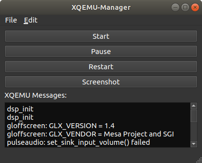

Getting XQEMU
-------------
**Download for Windows:** If you have a GitHub account, the latest pre-built release version of XQEMU for Windows can be [**downloaded here**](https://github.com/xqemu/xqemu.com/files/4371039/xqemu-release-0ced417.zip).

Linux and macOS users will need to build XQEMU from source, see [Building XQEMU from Source](developers/building.md).

Required Files
--------------
XQEMU is a low-level, full-system emulator which emulates the actual hardware of
the Xbox; this means that in order to actually run XQEMU, you must have a copy
of the stuff that a real Xbox needs when it turns on:

1. The MCPX Boot ROM image
2. The flash ROM image (aka *BIOS*)
3. A properly-formatted hard disk drive image
4. Game disc image(s)

Unfortunately, distributing some of these items would violate copyright laws, so
you'll need to acquire them on your own.

!!! attention

    The XQEMU project does not endorse or promote piracy. We don't link to
    copyrighted files, or discuss how to acquire them. The only legal way to
    acquire these files is to dump them from *your real, physical Xbox*. Please
    don't ask us how to get them.

#### MCPX Boot ROM Image

    MD5 (mcpx_1.0.bin) = d49c52a4102f6df7bcf8d0617ac475ed

If your MCPX dump has an MD5 of `196a5f59a13382c185636e691d6c323d`, you dumped
it badly and it's a couple of bytes off. It should start with `0x33 0xC0` and end
with `0x02 0xEE`.

#### Flash ROM Image (aka BIOS/Kernel)

Xbox 1.0 compatible BIOS (cromwell, 4034, 4036, ...). You can use a retail
or debug image. Just like a real Xbox, running an unmodified retail BIOS will
not allow booting unofficial software.

People have reported most success using the modified "COMPLEX 4627" BIOS (retail version).

#### Hard Disk Drive Image

You have options:

##### Option 1: Use a pre-built Xbox HDD image (recommended)

You can use a pre-built 8G Xbox HDD image, free of any copyrighted content, and
only containing a dummy dashboard. [You can download this image from
here!](https://github.com/xqemu/xqemu-hdd-image/releases)

!!! note

    By design, this particular drive image does not contain the official Xbox
    dashboard, but instead contains only a dummy dashboard. Because of this, you
    may see an error message when starting XQEMU with an unmodified retail BIOS
    image due to the system failing to find a properly signed dashboard.

    If you would like to change your dashboard (perhaps to the official retail
    dashboard, or any alternative dashboard), or copy additional files over to
    the Xbox HDD, you can start XQEMU, using a modified BIOS image, and a disc
    containing an alternative dashboard. Then you can either install that
    dashboard, or connect to XQEMU using FTP to transfer your desired dashboard
    files to the HDD.

##### Option 2: Image your real Xbox HDD

This is the most authentic way to do it. Unlock your drive, connect it to a
computer, and `dd` the entire contents of the drive straight to a file. This
file can be used as-is with XQEMU.

##### Option 3: Build a new HDD image from scratch

You can also create an Xbox hard-disk image using XboxHDM. Directions on how
to do this [can be found here](https://github.com/xqemu/xqemu-hdd-image).

Running XQEMU
-------------

XQEMU is launchable via the command-line interface, or through the [XQEMU-Manager
GUI](https://github.com/xqemu/xqemu-manager).

### Using XQEMU-Manager

XQEMU-Manager is a simple application with a graphical interface that allows you
to easily configure, launch, and control XQEMU. Currently it is distributed separately
from the main XQEMU executable. A binary distribution of XQEMU-Manager for Windows
is [available here](https://ci.appveyor.com/api/projects/xqemu-bot/xqemu-manager/artifacts/xqemu-manager.zip?branch=master&pr=false).

Upon starting XQEMU-Manager, you will be presented with the following interface:

You will need to edit your configuration to let XQEMU-Manager know where XQEMU
is located, and where to find the files described above. Navigate to
<kbd>Edit</kbd>&rarr;<kbd>Settings</kbd> and you will be presented with the
following dialog:

After configuring your settings, close the settings dialog and click the
<kbd>Start</kbd> button to launch XQEMU.

### Using the Command-Line Interface

You can launch with the following command:

    ./i386-softmmu/qemu-system-i386 \
        -cpu pentium3 \
        -machine xbox,bootrom=$MCPX \
        -m 64 \
        -bios $BIOS \
        -drive index=0,media=disk,file=$HDD,locked \
        -drive index=1,media=cdrom,file=$DISC \
        -usb -device usb-xbox-gamepad

Of course, on Windows the executable path will have a `.exe` extension. If launching
a pre-built binary, replace `./i386-softmmu/qemu-system-i386` with
`xqemu.exe`.

Replace the variables `$MCPX`, `$BIOS`, `$HDD`, and `$DISC` with the appropriate
file paths or define them as variables in your shell.

The Xbox boot animation sequence can be bypassed by adding the
`,short-animation` option to the `-machine` switch above.
