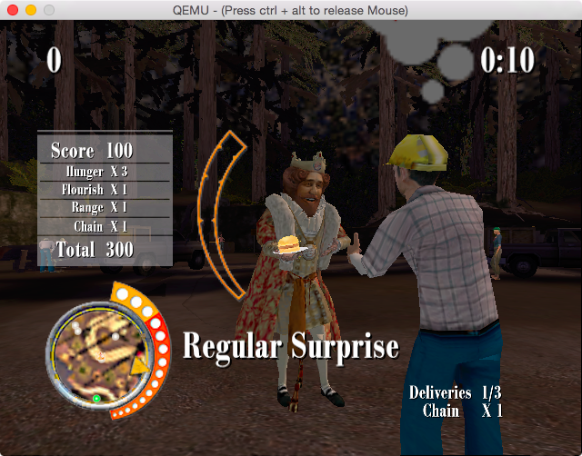
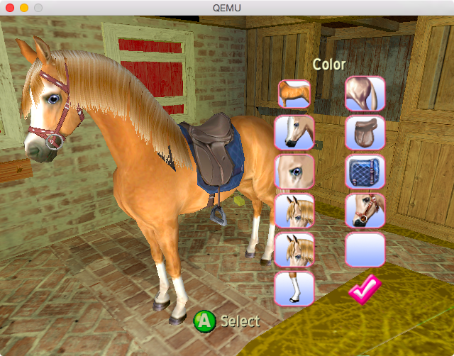

hero: An open-source, cross-platform emulator for the original Xbox.

XQEMU is an open-source, cross-platform, low-level system emulator for the
original Xbox and Sega Chihiro, built on the excellent
[QEMU](https://www.qemu.org/) project.

!!! attention
    This project is still early in development. At this point, the intended user
    is a **developer** who is capable of acquiring the necessary ROM images,
    building a hard disk image, and compiling the project from sources.

Project Status
--------------
Audio does not work, and graphics are slow and buggy, but
progress is being made! Please visit the [issues
page](https://github.com/xqemu/xqemu/issues) on GitHub for the current open and
active tasks.

Get Involved
------------
If you are interested in helping to create a functional, accurate, and
performant Xbox emulator, you are most welcome to contribute! The project is
hosted on [GitHub](https://github.com/xqemu/xqemu). Keep up with the latest
developments by chatting with us about **development topics** on `#xqemu` on
irc.freenode.net, or on [Discord](https://discord.gg/WxJPPyz).

Screenshots / Videos
--------------------

!!! info "Disclaimer"
    These screenshots represent the **absolute best** of what can
    currently be made to run and is not representative of most titles.

#### Halo: Combat Evolved

<iframe width="560" height="315" src="https://www.youtube.com/embed/qlXSDqkNkJg" frameborder="0" allow="autoplay; encrypted-media" allowfullscreen></iframe>

#### Jet Set Radio Future

<iframe width="560" height="315" src="https://www.youtube.com/embed/MVwB1jCzkWs" frameborder="0" allow="autoplay; encrypted-media" allowfullscreen></iframe>

#### Sneak King

#### Barbie Horse Adventures

