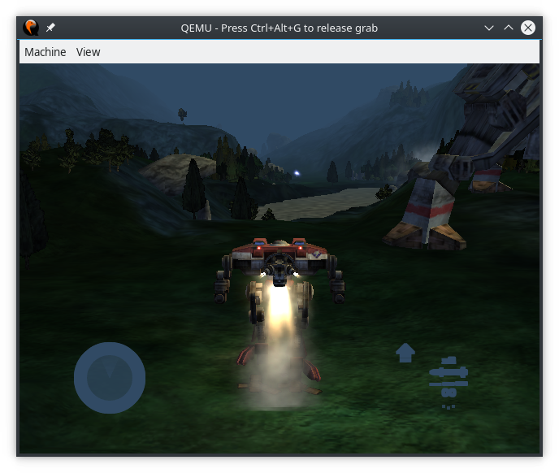

!!! info "Disclaimer"

    These screenshots represent the **absolute best** of what can currently be
    made to run and is not representative of most titles.

Check out the [official XQEMU project YouTube channel](https://youtube.com/xqemu)
for development updates.

### Halo: Combat Evolved

#### Campaign

Note: Debug Build, Accelerated 4x

<iframe width="560" height="315" src="https://www.youtube.com/embed/qlXSDqkNkJg" frameborder="0" allow="autoplay; encrypted-media" allowfullscreen></iframe>

#### Multiplayer: Blood Gulch (System Link)

<iframe width="560" height="315" src="https://www.youtube.com/embed/17L8Te-cQbo?start=30" frameborder="0" allow="autoplay; encrypted-media" allowfullscreen></iframe>

#### Multiplayer: Blood Gulch, Battle Creek (Split Screen)

Note: Debug Build, Realtime, June 20th

<iframe width="560" height="315" src="https://www.youtube.com/embed/gm_DY6orkH4" frameborder="0" allow="autoplay; encrypted-media" allowfullscreen></iframe>

### Jet Set Radio Future

<iframe width="560" height="315" src="https://www.youtube.com/embed/MVwB1jCzkWs" frameborder="0" allow="autoplay; encrypted-media" allowfullscreen></iframe>

### Serious Sam II

<iframe width="560" height="315" src="https://www.youtube.com/embed/nyvFLIzTxPs" frameborder="0" allow="autoplay; encrypted-media" allowfullscreen></iframe>

Commit `5d4058d`. Recorded by John GodGames, thanks!

### Mechassult

Taken by MayeulC, thanks!

### Tony Hawk's Pro Skater 2x

Note: Debug Build, Realtime

<iframe width="560" height="315" src="https://www.youtube.com/embed/dBg_P3oAwXo" frameborder="0" allow="autoplay; encrypted-media" allowfullscreen></iframe>
